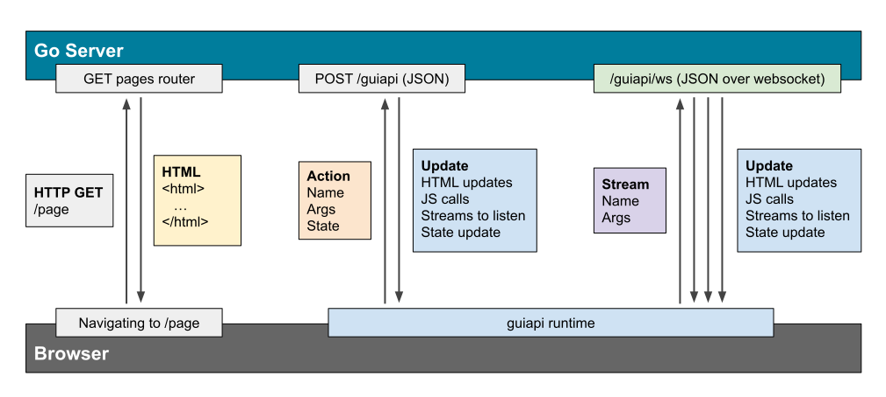

# `guiapi` - Multi Page Web App Framework for Go

[](https://pkg.go.dev/github.com/mbertschler/guiapi)
[](https://www.npmjs.com/package/guiapi)

Guiapi (an API for GUIs) is a framework for building interactive multi page web
applications with minimal JavaScript, using Go on the server side for handling
most of the logic and rendering the HTML. Besides rendering the different pages,
it can also update the DOM from the server side, after a server Action was triggered
by a browser event or JavaScript. It tries to minimize the amount of JavaScript
that needs to be written and sent to the browser.

# Principles

Guiapi lives between the worlds of an old school web app, that required a full
page reload for every user action and a typical modern single page app that
requires a REST API and lots of JavaScript to render the different HTML views.

You should give this framework a try, if you agree with the following principles
that guiapi is built on:

- Rendering HTML should not require a REST API
- Most web apps should be multi page apps out of the box
- Most of the web apps logic should run on the server side
- Most HTML should be rendered on the server side
- JavaScript should only be used for features where it is necessary

### Is this an alternative to React and other frontend frameworks?

The short answer is no. The goal of guiapi is to provide a framework for a multi
page server rendered web app, which is a different goal than that of a frontend
framework. It can make sense to use guiapi and a frontend framework together.
The main structure of the different pages and inital page layout can be provided
via guiapi pages, and afterwards the frontend framework takes over for user
interface components that require a high degree of interactivity. These could be
complex form validations, interactive data visualizations and similar, where server
roundtrips for every update to the UI would not make sense.

In practice though, many web apps today are built with a frontend framework which 
renders 100% of the UI in the browser, even if most of the pages don't need this high
degree of interactivy. Instead the pages could just as easily be rendered server side.
In those cases it might not even be necessary to use a framework, and the same 
end result can be achieved with just a few lines of vanilla JavaScript for the
interactive components.  

# Concepts



### Pages

Pages represent the different views of your app. They can be accessed directly by
navigating to the page URL, in which case the server returns a usuale HTML document.
If you are navigating from one guiapi Page to the next, this can even happen via an
Action and Update. In this case no full page reload is needed, but the URL and page
content is still updated as if the page was visited directly.

### Actions

Actions are events that are sent from the browser to the server. They can either be
originating from a HTML element with `ga-on` attribute, or from the guiapi `action()`
JavaScript function. Actions consist of a name and optional arguments. These
actions are transferred as JSON via a POST request to the endpoint that is typically
called `/guiapi`. The response to an Action is an Update.

### Updates

Updates are sent from the server to the browser. They can be the response to an
Action, or they can be sent via a Stream. Updates consist of a list of HTML updates,
JS calls and Streams to connect to.

#### HTML updates
After an update is received, the HTML updates are applied to the DOM. This can for
example mean that the the element with the selector `#content` should be replaced
with some different HTML, or that a new element should be inserted before or after
a spefic selector.

#### JS calls
JS calls can be explicitly added to an Update, and the function with the given name
will be called with the passed arguments. For this to work the function first needs
to get registered. Besides an explicit JS call it is often useful to run some
JavaScript in relation to one of the newly added HTML elements. In this case the
new HTML needs to have one of the special guiapi attributes like `ga-init`.

### State

Sometimes a web page has a certain state that needs to be known to the server too,
for example filter settings for a list of items. This state gets transferred with
ever Action to the server, and can be updated by receiving a new state in an Update.
The state is similar to a cookie and usually doesn't need to be accessed by client
JavaScript functions.

### Streams

Streams are similar to Actions that return an Update, but instead of returning just
a single Update, the Stream can return many Updates over time, until the Stream is 
closed. This is not done via a HTTP request, but via a WebSocket connection. Similar
to actions, a Stream also consists of a name and arguments.

> [!WARNING]  
> While the other concepts of guiapi (Pages, Actions, Updates) have been proven useful
> in web applications since 2018, Streams are a new concept for server sent updates and
> should be considered experimental. They might change significantly in the future.

# API Documentation

The guiapi API consists of the Go, JavaScript and HTML attribute APIs.

## Go API

See [Go package documentation](https://pkg.go.dev/github.com/mbertschler/guiapi).
The main types to look out for are `Server` which handles HTTP requests, `Page`
for page rendering and updating, and `Request` and `Response` that explain the
RPC format.

### Asset bundling using `esbuild`

The [assets package](https://pkg.go.dev/github.com/mbertschler/guiapi/assets) contains
a wrapper around [esbuild](https://esbuild.github.io/) that can be used to bundle
JavaScript and CSS assets.

With this package you don't need an external JS bundler, as the building can happen
every time you start the Go binary to embed your assets. The `esbuild` tool adds about
5 MB to the binary size, so if you don't need this functionality in production and
include the built assets in another way, for example with `go:embed`, then you can use
the `no_esbuild` build tag like this: `go build -tags no_esbuild`, which replaces the
asset building function with a no-op. You can check if the `esbuild` tool is available
with the `assets.EsbuildAvailable()` function.

## HTML attribute API

The following attributes get activated when `setupGuiapi()` is called after the page
load, and they also get initialized whenever they appear in HTML that was updated by
an Update from an Action or Stream.

#### Event handlers: `ga-on`

```html
<button class="ga" ga-on="click" ga-func="myClickFunction">click me</button>
<button class="ga" ga-on="click" ga-action="Page.Click" ga-args="abc">click me</button>
```

The `ga-on` attribute is used to trigger a server action or JavaScript functions every time
the event name specified in the attribute happens event listeners on HTML elements. In
the first example above, the `myClickFunction` function is called every time the button is
clicked. In the second example, the `Page.Click` server action is called with "abc" as the
argument.

```html
<input class="my-form" type="text" name="name" />
<input class="my-form" type="number" name="amount" />
<button class="ga" ga-on="click" ga-action="Page.Click" ga-values=".my-form">submit</button>
```

If you want to submit multiple inputs to a server action, you can use the `ga-values`
attribute. The value of the attribute gets passed to `document.querySelectorAll()` and
all .... value, name

#### Initializer functions: `ga-init`

```html
<div class="ga" ga-init="myInitFunction" ga-args='{"val":123}'></div>
```

If the `ga-args` can't be parsed as JSON, they are passed as a string to the
function.

#### Lightweight page load: `ga-link`

```html
<a href="/other/page" class="ga" ga-link>other page</a>
```

If you add `ga-link` attribute to an `a` with a `href`, clicking on the link
will navigate to the other page via a guiapi call and partial page update
without reloading the whole page. Behind the scenes the history API is used,
so that navigating back and forth still works as expected. This is useful if
you have some JavaScript logic that should keep running between pages and
should also speed up page navigation.

## JavaScript API

To make a guiapi app work, the `setupGuiapi()` function needs to be called.
Before that, any functions that are referenced from HTML or update JSCalls
need to be registered with `registerFunctions()`.

#### Calling a server action from JavaScript

```ts
action(name: string, args: any, callback: (error: any) => void)
```

This can be used to run a server action from any JavaScript. The callback is called
with any potential error after the update from the server was applied.

#### Registering your JS functions for guiapi

```ts
registerFunctions(obj: { string: Function })
```

Registers functions that can be called from HTML via `ga-func` or `ga-init` and
also makes them available for JSCalls coming via a server update.

#### Initializing the guiapi app

```ts
setupGuiapi(config: {
  state: any,
  stream: {
    name: string,
    args: any,
  },
  debug: boolean,
  errorHandler: (error: any) => void,
})
```

This initializes all HTML elements with the `ga` class and sets up the event listeners.
Functions that are referenced from the HTML with `ga-func` or `ga-init` need to be
registered with `registerFunctions()` before calling `setupGuiapi()`.

#### Debug logging

```ts
debugPrinting(enable: boolean)
```

With this function you can turn on or off loging whenever guiapi calls an action and
receives an update from the server. This can be useful during development.

## Examples

Go to [`./examples`](./examples/) and start the web server with `go run .` to access
the 3 examples with your web browser at localhost:8000.

The 3 examples are:

- `/` contains a guiapi implentation of [TodoMVC](https://todomvc.com/)
- `/counter` is a simple counter that can be increased and decreased
- `/reports` is a demonstrates streams by updating the page from the server

The examples are a good starting point to build your own app with guiapi.

# Contributing

If you are using guiapi and have any feedback, please let me know.
Issues and discussions are always welcome.

---

Built by [@mbertschler](https://x.com/mbertschler)
